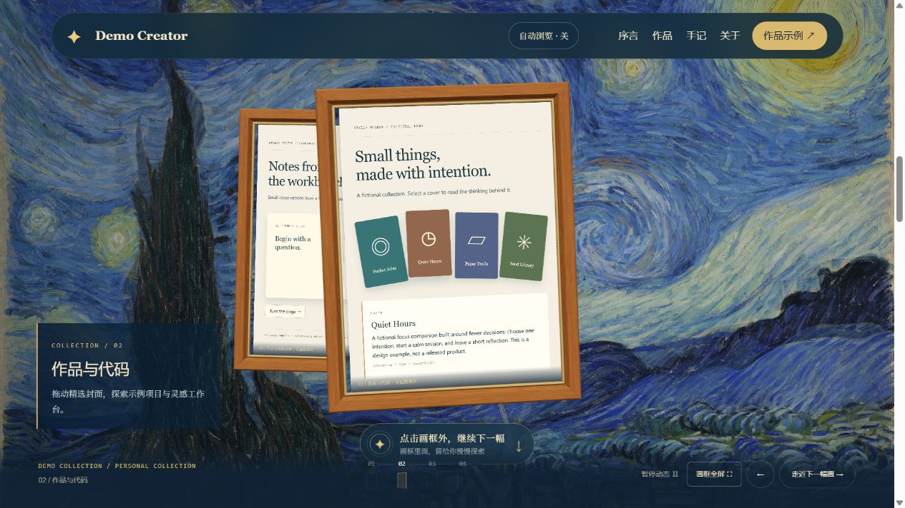

# Starry Museum

[Live demo](https://skyjjgw.github.io/starry-museum-portfolio/) · [Source](https://github.com/skyjjgw/starry-museum-portfolio)



A personal website as a small, walkable exhibition: a flowing *Starry Night*, floating oak frames, and live interactive content inside each painting.

This repository contains **only the museum interface**. The four exhibits use fictional projects and an anonymous sample profile. It does not include a second portfolio application, a backend, analytics, credentials or deployment secrets.

## Run

The built static site is included. Serve this folder using any static HTTP server:

```sh
python -m http.server 4173
```

Open http://localhost:4173/. Use HTTP rather than opening files directly: the frame interactions rely on same-origin documents and WebGL textures.

To rebuild the checked-in JavaScript bundles (Node.js 20+):

```sh
npm ci
npm run build
npm test
```

## Customize

- `content.js`: fictional profile, project summaries, skills and notebook entries.
- `index.html`: museum introduction, navigation, exhibit labels and closing invitation.
- `exhibit.js` / `exhibit.css`: project covers, notebook and silver profile card.
- `portal-tour.js`: 3-second reading interval and 2.4-second transitions.
- `src/portal-starry.js`: oak mouldings and camera choreography.
- `src/starry-flow.js`: full-image flow shader integration.

The museum shell is in Simplified Chinese; sample exhibit content is English. These are editable demo strings, not an automatic bilingual feature. Add your real project descriptions and links only when making your own copy. Sample projects are explicitly fictional and make no claims about a real creator.

## Interaction and fallbacks

- Scroll, use the numbered navigation or click outside the frame to continue.
- Automatic browsing is off by default and can be switched on or off; interaction returns control to the visitor.
- Project covers and the notebook work directly inside the frame.
- Expand a frame for comfortable reading; Escape exits it.
- Pause freezes ambient animation. Reduced-motion preference disables autoplay and ambient movement.
- On small screens the scene caps pixel ratio at 1 and animation at 30 FPS, uses a smaller painting texture, and loads exhibits progressively.
- When WebGL is unavailable, ordinary exhibit links remain available. JavaScript is needed to populate the example exhibit content.

## Distribution

No build or remote API is required to serve the included distribution. Optional development dependencies are Three.js and esbuild. The artwork assets are local. Keep relative paths intact when deploying under a subdirectory.

`adapters/targets.json` records the three different submission formats. `adapters/export.mjs` makes a Freefolio-compatible static folder without npm files. Reference directories should receive a screenshot and reference document, not a duplicate application.

## Attribution and license

Template-specific code: MIT, see [LICENSE](LICENSE). Third-party assets retain their own terms; see [ATTRIBUTION.md](ATTRIBUTION.md). The project was developed with AI assistance and reviewed through source checks and browser interaction tests. This does not imply endorsement by Vincent van Gogh's museums, asset authors, or any collection accepting the template.
